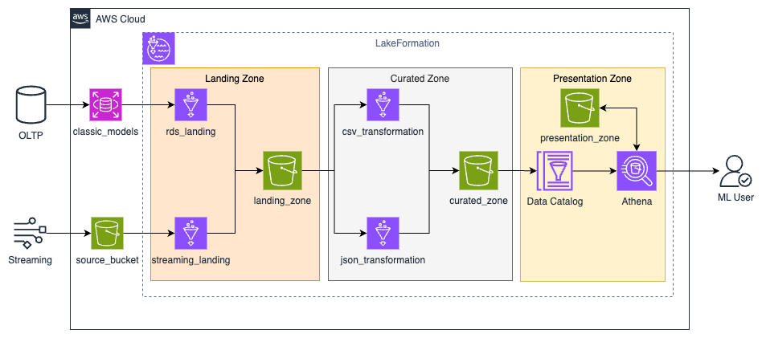

# Modern Data Lakehouse Implementation with AWS and Apache Iceberg

[](https://aws.amazon.com/)
[](https://iceberg.apache.org/)
[](https://www.terraform.io/)

A sophisticated data engineering project implementing a modern data lakehouse architecture using AWS services and Apache Iceberg. The project demonstrates advanced data engineering concepts including medallion architecture, data governance, and analytics integration.

## Project Overview

This project implements a scalable data lakehouse solution for a global car retailer, processing both batch and streaming data through a medallion architecture. The implementation includes automated ETL pipelines, data quality controls, and analytics integration.

## Architecture



The architecture implements a three-layer medallion approach:

1. **Landing Zone**: Raw data ingestion from multiple sources
   - RDS MySQL database ingestion via AWS Glue
   - Streaming data landing in S3

2. **Curated Zone**: Data transformation and enrichment
   - Schema enforcement and metadata addition
   - Apache Iceberg table implementations
   - Data quality checks and transformations

3. **Presentation Zone**: Analytics-ready data
   - Business objects creation
   - Performance-optimized queries
   - Integration with analytics tools

## Key Features

- **Infrastructure as Code (IaC)**: Complete infrastructure deployment using Terraform
- **Data Governance**: Implemented using AWS Lake Formation
- **Schema Evolution**: Managed through Apache Iceberg
- **Automated ETL**: AWS Glue jobs for data transformation
- **Security**: Fine-grained access control for different user personas
- **Analytics Integration**: Direct query capability using Amazon Athena

## Analytics Dashboard

The project includes a comprehensive analytics dashboard built in Tableau, analyzing key business metrics:


[View Interactive Dashboard](https://public.tableau.com/views/CarRetailer/Dashboard1?:language=en-US&:sid=&:redirect=auth&:display_count=n&:origin=viz_share_link)

The dashboard provides insights into:
- Sales growth trends over time
- Top performing salespeople analysis
- Sales efficiency metrics (volume vs. high-value deals)
- Commission rate impact on earnings

## Technical Implementation

### AWS Services Utilized
- **S3**: Data lake storage
- **Glue**: ETL job orchestration
- **Lake Formation**: Data governance
- **Athena**: SQL query engine
- **RDS**: Source database system


### Infrastructure
- Terraform modules for each architectural layer
- Automated deployment scripts
- Environment configuration management

## Prerequisites

- AWS Account with appropriate permissions
- Terraform installed
- AWS CLI configured
- Python 3.7+

## Getting Started

1. Clone the repository
```bash
git clone [repository-url]
```

2. Configure AWS credentials
```bash
aws configure
```

3. Initialize Terraform
```bash
cd terraform
terraform init
```

4. Deploy the infrastructure
```bash
terraform apply
```

## Project Structure
```
├── scripts/
│   ├── init.py
│   └── lf_utils.py
├── terraform/
│   ├── modules/
│   │   ├── alter_table/
│   │   ├── landing_etl/
│   │   └── transform_etl/
│   ├── assets/
│   │   ├── landing_etl_jobs/
│   │   └── transform_etl_jobs/
│   ├── main.tf
│   ├── variables.tf
│   └── outputs.tf
└── images/
```

## Data Governance

The project implements comprehensive data governance using AWS Lake Formation:
- Role-based access control
- Column-level security
- Audit logging
- Data lineage tracking

## Performance Optimizations

1. **Storage Optimization**
   - Partitioning strategy implementation
   - Apache Iceberg table format benefits
   - Compression techniques

2. **Query Performance**
   - Materialized views
   - Optimized table structures
   - Efficient join strategies

## Contributing

Contributions are welcome! Please feel free to submit a Pull Request.


## Acknowledgments

- AWS Documentation
- Apache Iceberg Community
- Terraform Documentation
